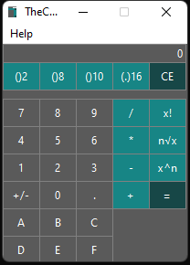

# TheCalcIsALie

A project involving a GUI calculator and a simple math library.  


Usage
---------
* Enter numbers using your keyboard or using the buttons in the UI.
* Choose an operation with the respective buttons or keyboard keys.
* Choose an operations second operand, if it requires.
* Press equals to show the result, or press another operation button to chain calculations.
* Change the shown number system using the four conversion buttons located at the top.
* The +/- button changes the sign of currently displayed value.
* Help menu contains the PDF documentation guide.

For further instructions please see the attached guide in file: [dokumentace.pdf](dokumentace.pdf).

Installing
---------
Download the latest release at: https://github.com/Noemkinator/TheCalcIsALie/releases/latest.  
Next run the downloaded installer and follow the shown instructions.  
Select the installation directory and continue to install.  
The installed calculator will be located in the Start menu, you can choose to add a desktop icon during the installation.

Build requirements (Windows):
---------
[Make for Windows](http://gnuwin32.sourceforge.net/packages/make.htm)  
[CMake3 for Windows](https://cmake.org/download/)  
[Latest version of QT6](https://www.qt.io/)

Build instructions (Windows):
---------
Open the QT MinGW shell that is preinstalled with the QT6 installation, then enter the downloaded folder.
```
# cd src
# make
```
To run the built program enter the command:
```
# make run
```

Made for purposes of:
---------
* Practical Aspects of Software Design
* Brno University of Technology, Faculty of Informational Technology

Environment
---------
Windows 64bit

Authors
------
Team name: TheCalcIsALie
- xzajic22 Jan Zajíček 
- xsocha02 Jakub Socha 
- xtrutn00 Veronika Trutnovská 
- xpuchn02 Ivo Puchnar 

Licence
-------
This software is licenced under the under the GNU General Public License v3.0.
